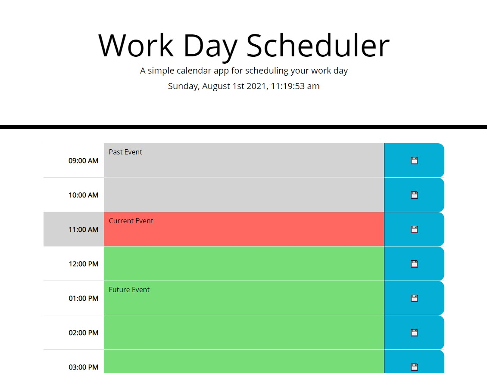

# My Work Day Scheduler
https://myuze.github.io/calendar-fm/

Add events to the calendar.

    - Hours in the past appear grey.
    - The current hour appears in red.
    - Upcoming hours appear in green.

    - After entering an event, click the lock button to the right save an event.

